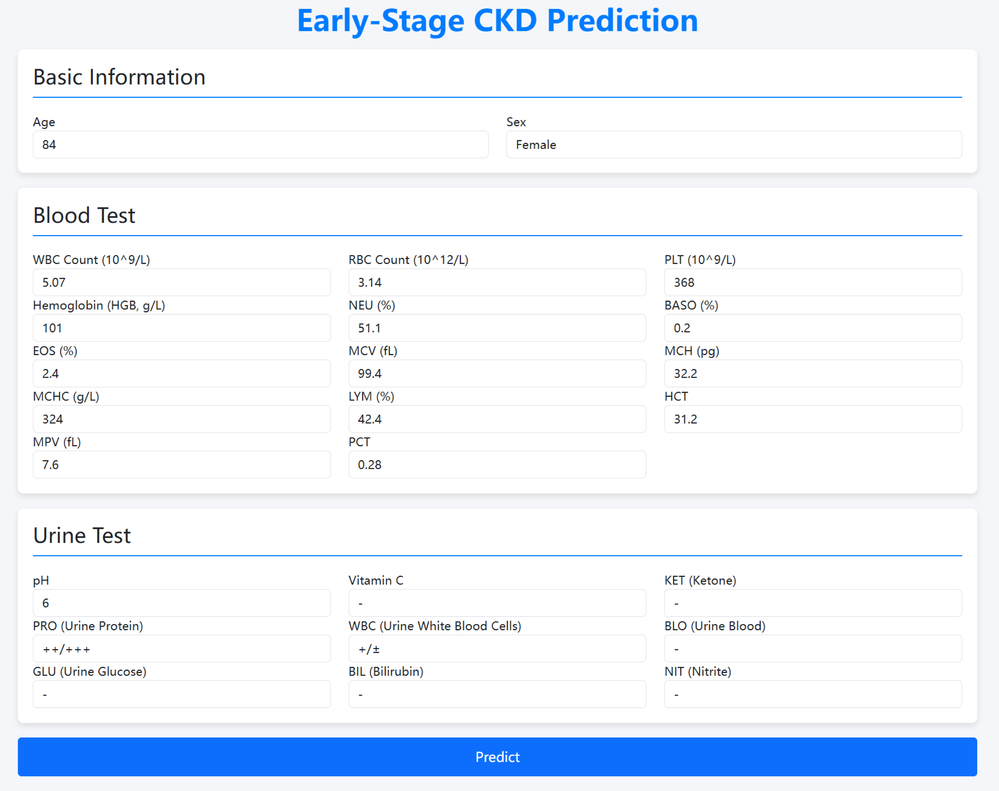
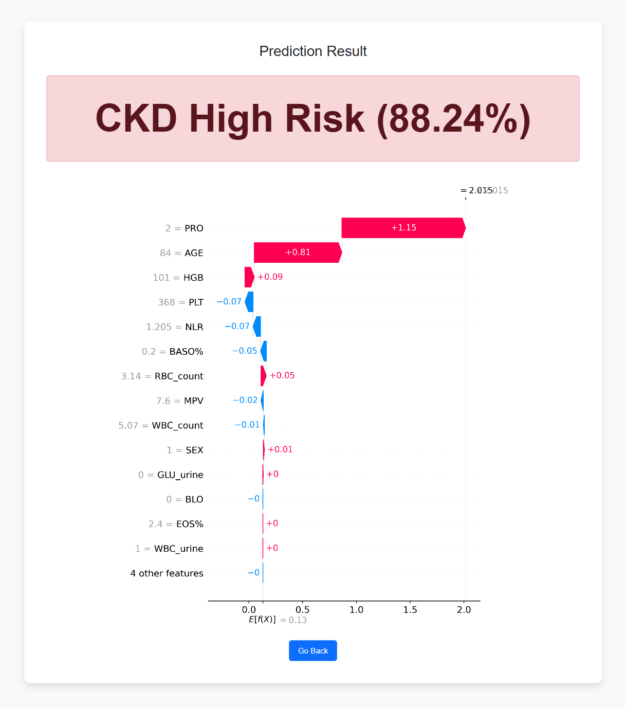

<h1 align="center">Early-Stage CKD Prediction</h1>


## Introduction
This study, based on a multicenter retrospective cohort dataset, aims to develop and validate an interpretable ML model for early-stage CKD, quantify key risk factors, and predict early-stage CKD (CKD stages 1-2). The model is designed as a web-based online tool to assist health checkup centers and other non-nephrology specialty outpatient clinics in identifying potential CKD risk patients for follow-up evaluation.


## Code Structure Overview

1. **Data Processing**  
   This part includes dataset loading, and splitting into training, validation, and test sets.  
   🔧 Reference: [`data_processing.py`](./scripts/data_processing.py)

2. **Model Training and Validation**  
   Includes model training, evaluation of different feature combinations, and internal validation.
   The trained models are exported in `.pkl` format for reproducibility and further application.
   Evaluation metrics include:  Confusion Matrix，ROC Curve, PR Curve ，Youden’s J index ，Accuracy, Precision, Recall, F1-score, AUC  
   🔧 Reference: [`model_training.py`](./scripts/model_training.py)

3. **Interpretability Analysis**  
   SHAP is used to interpret feature importance and explain model predictions.  
   🔧 Reference: [`interpretability.py`](./scripts/interpretability.py)

4. **Other Utilities**  
   Includes statistical significance testing (DeLong test) and k-fold cross-validation procedures.  
   🔧 Reference: [`other.py`](./scripts/other.py)


> Note: The above scripts contain core implementations of the study.  


## Website
1. **URL**

    http://8.153.72.192/

2. **Demonstration**
<div align="center">
  
  
</div>


## Citation
If you would like to cite this work, please use the following format:

```tex
@article{HE2025103286,
title = {Identification and validation of an explainable early-stage chronic kidney disease prediction model: a multicenter retrospective study},
journal = {eClinicalMedicine},
volume = {84},
pages = {103286},
year = {2025},
issn = {2589-5370},
doi = {https://doi.org/10.1016/j.eclinm.2025.103286},
url = {https://www.sciencedirect.com/science/article/pii/S2589537025002184},
author = {Jiayi He and Xin Wang and Peiqi Zhu and Xiaoxu Wang and Yitong Zhang and Jing Zhao and Wei Sun and Kongfa Hu and Weiming He and Jiadong Xie},
}
```
